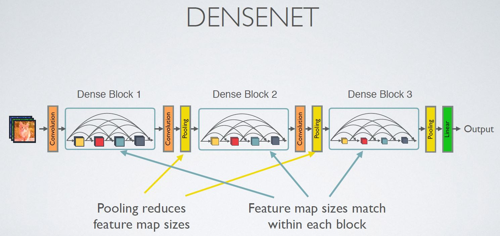
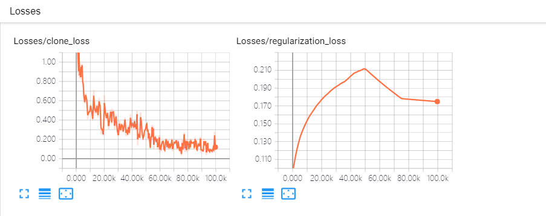
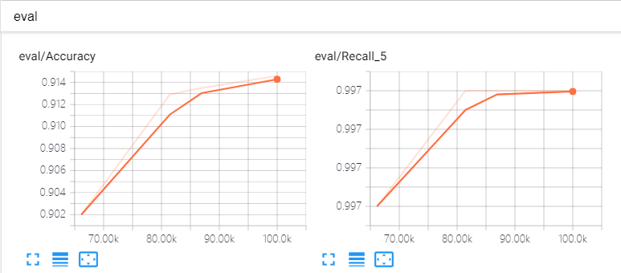

# Densenet trained on quiz and cifar10

## Densenet基本架构

其主要结构包括： 
- Input:  
- DenseBlock：  
  - compostion：  
  - bottleneck：
- Transition layer：  
- Output  

## Input  
large_mem主要是为了标识是否采用大的gpu memory来训练，如果memory size较小，图片size又比较大的情况下，则利用kernel=[9,9]，stride=3的卷积，减小对内存的消耗  
在cifar数据集上，考虑到图片本身size较小，输入数据仅做kernel=3x3,stride=2的卷积，而不做pooling
```python
  if large_mem == True:
        max_size = 400
    else:
        max_size = 270
    
    inputs_shape = inputs.get_shape().as_list()
    if inputs_shape[1] >max_size:
        end_point = scope + '_conv9x9'
        net = slim.conv2d(inputs,grow_rate*2,[9,9],stride=3,scope=end_point)
        end_points[end_point] = net

        end_point = scope + '_mpool3x3'
        net = slim.max_pool2d(net,[5,5],stride=2, padding='same',scope=end_point)
        end_points[end_point] = net
    elif inputs_shape[1] >100:
        end_point = scope + 'conv7x7'
        net = slim.conv2d(inputs,grow_rate*2,[7,7],stride=2,scope=end_point)
        end_points[end_point] = net

        end_point = scope + '_mpool3x3'
        net = slim.max_pool2d(net,[3,3],stride=2, padding='same',scope=end_point)
        end_points[end_point] = net
    else:
        end_point = scope + '_conv3x3'
        net = slim.conv2d(inputs,grow_rate*2,[3,3],stride=2, padding='same',scope=end_point)
        end_points[end_point] = net
```

## DenseBlock
Densenet的核心就在denseblock上，一个net由多个denseblock组成。 
一个Denseblock由多个composition layer构成，如下图：(图片均来自(https://github.com/taki0112/Densenet-Tensorflow))    


denseblock中，每层网络的输出的神经元数量都是grow_rate，输入是由之前每层的输出与denseblock的输入之和，这里的“和”指的是神经元数量相加。比如：  
  假设denseblock的输入为H(0)，第1,2,..n层第二层输出为H(1),H(2),H(n-1)  
  那么第n层的输入为：H(n)in = H(0) + H(1) + H(2) + ... + H(n-1)  
  denseblock的输出为：H = H(0) + H(1) + H(2) + ... + H(n)
      
  - __这里的相加，在网络上的表现为第n层网络与前面(0,1,...n-1)层网络都有连接，这种连接也就是稠密连接(Dense connect)__  
  - __由于每层的输出为grow_rate，因此每增加一层，denseblock最终的输出的维度都要增加grow_rate__  
  比如：输入的维度为(n,h,w,k),denseblock的层数(compsition)为12，那么输出的维度为，k + 12 * grow_rate

代码实现如下：
```python
def densenet_block(net,keep_proba,grow_rate,layers = 12,scope=None,use_BC=True):
    """
    Args:
      net: input op
      keep_proba: probability of keeped in drop out
      grow_rate: the grow rate of 
    """
    with tf.variable_scope(scope,'block',[net]):
        # put input net to net list
        net_list = list()
        net_list.append(net)
        for i in range(layers):
            
            if use_BC == True:
                #apply bottle neck layer
                end_point = scope + 'bottleneck' + str(i)
                net = bottleneck_layer(net,keep_proba,grow_rate,scope=end_point)
            
            #apply composition layer
            end_point = scope + 'composition' + str(i)
            net = composition_layer(net,keep_proba,grow_rate,scope=end_point)
            net_list.append(net)
            #output_depth = output_depth + grow_rate
            
            #do merge net list
            end_point = scope + 'layer' +str(i)
            net = tf.concat(values=net_list,axis=3,name=end_point)
        return net
```


### Compsition with bottleneck
denseblock的基本组成单元，如下图是带bottleneck layer的

bottleneck主要目的是为了输入数据做降维，一般都是降至 4 * grow_rate

#### bottleneck代码实现如下
```python
def bottleneck_layer(net,keep_proba,grow_rate = 12,scope = None):
    with tf.variable_scope(scope,'bottleneck',[net]):
		#batch norm --- relu --- conv1x1 --- drop out
        end_point = scope + 'bn'
        net = slim.batch_norm(net,scope=end_point)
        end_point = scope + 'relu'
        net = tf.nn.relu(net,name=end_point)
        end_point = scope + 'conv1x1'
        net = slim.conv2d(net, 4*grow_rate, [1, 1], stride=1, scope=end_point)
        end_point = scope + 'drop'
        net = slim.dropout(net, keep_prob=keep_proba, scope=end_point)
        return net
```

#### compositin，主要包括一个3x3的卷积
代码如下：
```python
def composition_layer(net,keep_proba,grow_rate = 12,scope=None):
    with tf.variable_scope(scope,'composition_layer',[net]):
        #batch norm --- relu --- conv3x3 --- drop out
        end_point = scope + 'bn'
        net = slim.batch_norm(net,scope=end_point)
        end_point = scope + 'relu'
        net = tf.nn.relu(net,name=end_point)
        end_point = scope + 'conv3x3'
        net = slim.conv2d(net, grow_rate, [3, 3], stride=1, scope=end_point)
        end_point = scope + 'drop'
        net = slim.dropout(net, keep_prob=keep_proba, scope=end_point)
        return net
```


### Transition layer
连接两个不同的denseblock，并利用pooling降低输入数据size  
theta是对输入数据进行降维的比例  

代码如下：
```python
def transition_layer(net,keep_proba,theta = 0.5,scope = None):
    with tf.variable_scope(scope,'transition_layer',[net]):
        #batch norm --- conv 1x1(theta) --- drop out --- pooling(2x2,stride=2)
        end_point = scope + 'bn'
        net = slim.batch_norm(net,scope=end_point)
        end_point = scope + 'compress'
        net_shape = net.get_shape().as_list()
        output_depth = int(theta*net_shape[-1])
        net = slim.conv2d(net, output_depth, [1, 1], stride=1, scope=end_point)
        end_point = scope + 'drop'
        net = slim.dropout(net, keep_prob=keep_proba, scope=end_point)
        end_point = scope + 'pool'
        net = slim.avg_pool2d(net, [2,2], stride=2, scope=end_point, padding='same')
        return net 
```

### Output  
最后一个denseblock后面没有接transition layer，而是接一个size与输入size相同的pooling layer，然后再接一个数量为类别数的全卷积  
代码如下：
```python
 end_point = scope + '_gpool'
  net_shape = net.get_shape().as_list()
  net = slim.avg_pool2d(net,[net_shape[1],net_shape[2]],stride=1, padding='valid',scope=end_point)
  end_points['globalpool'] = net

  end_point = scope + '_fc'
  net = tf.contrib.layers.flatten(net)
  logits = slim.fully_connected(net,num_classes,scope=end_point,activation_fn=None)
  end_points['logit'] = net
  predictions = prediction_fn(logits, scope='predictions')
  end_points['prediction'] = predictions
```

## 在quiz数据集上的运行结果  
train截图，Excution ID:znli99s0  


在train数据集上验证准确率，Excution ID:4ijmgus5  


在validation数据集上验证准确率，Excution ID:0mflju56  


## 在cifar数据集上运行结果  
在cifar数据集上,主要参数如下：    
L = 100 (with bottleneck and compression rate = 0.5)  
weight_decay=4e-5  
batch_size=100  
max_number_of_steps=100000  
learning rate= 0.1  
optimiser=momentum  

learning rate下降方式采用stage的方式，train_image_classifier.py中添加如下： 
```python 
  elif FLAGS.learning_rate_decay_type == 'stage':
    learning_rates = [FLAGS.learning_rate, FLAGS.learning_rate*0.1, FLAGS.learning_rate*0.01]
    steps = [int(FLAGS.max_number_of_steps * 0.5), int(FLAGS.max_number_of_steps * 0.75)]
    return tf.train.piecewise_constant(tf.to_int32(global_step),steps, learning_rates,name='stage_decay_learning_rate')
```

结果如下：  
loss:  
  

learning rate:  
  

acc:  
  

相比较上个版本，accuracy on test从0.86提高到了0.914，训练只跑了200 epochs，没有复现原作到0.95左右的准确率，怀疑是epoch太少导致的。  
跑一次花了32.5个小时，这次先到这里吧，训练太累了。  