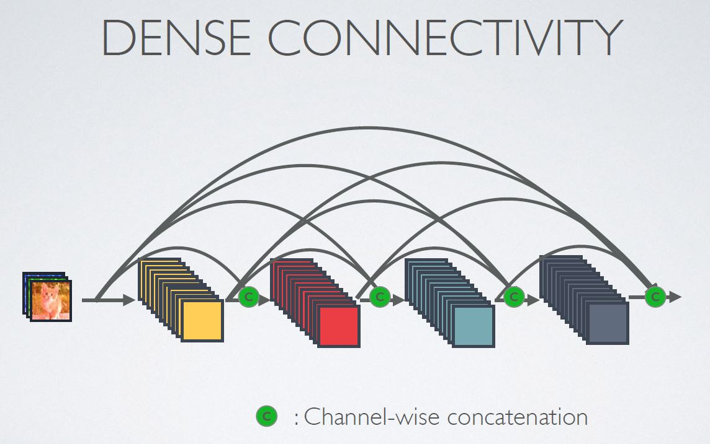
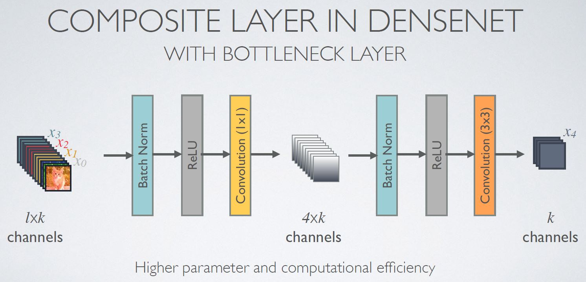
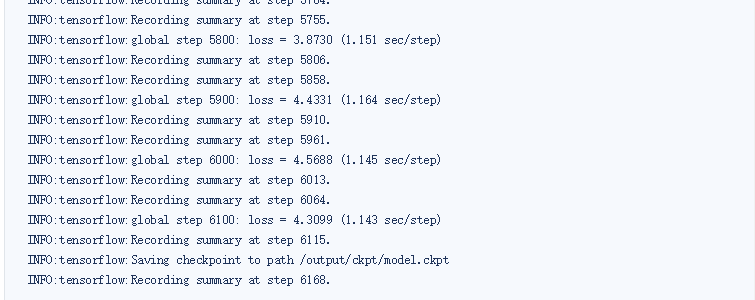

# Densenet trained on quiz and cifar10

## Densenet基本架构

其主要结构包括： 
- Input:  
- DenseBlock：  
  - compostion：  
  - bottleneck：
- Transition layer：  
- Output  

## Input  
large_mem主要是为了标识是否采用大的gpu memory来训练，如果memory size较小，图片size又比较大的情况下，则利用kernel=[9,9]，stride=3的卷积，减小对内存的消耗  
在cifar数据集上，考虑到图片本身size较小，输入数据仅做kernel=3x3,stride=2的卷积，而不做pooling
```python
  if large_mem == True:
        max_size = 400
    else:
        max_size = 270
    
    inputs_shape = inputs.get_shape().as_list()
    if inputs_shape[1] >max_size:
        end_point = scope + '_conv9x9'
        net = slim.conv2d(inputs,grow_rate*2,[9,9],stride=3,scope=end_point)
        end_points[end_point] = net

        end_point = scope + '_mpool3x3'
        net = slim.max_pool2d(net,[5,5],stride=2, padding='same',scope=end_point)
        end_points[end_point] = net
    elif inputs_shape[1] >100:
        end_point = scope + 'conv7x7'
        net = slim.conv2d(inputs,grow_rate*2,[7,7],stride=2,scope=end_point)
        end_points[end_point] = net

        end_point = scope + '_mpool3x3'
        net = slim.max_pool2d(net,[3,3],stride=2, padding='same',scope=end_point)
        end_points[end_point] = net
    else:
        end_point = scope + '_conv3x3'
        net = slim.conv2d(inputs,grow_rate*2,[3,3],stride=2, padding='same',scope=end_point)
        end_points[end_point] = net
```

## DenseBlock
Densenet的核心就在denseblock上，一个net由多个denseblock组成。 
一个Denseblock由多个composition layer构成，如下图：(图片均来自(https://github.com/taki0112/Densenet-Tensorflow))    


denseblock中，每层网络的输出的神经元数量都是grow_rate，输入是由之前每层的输出与denseblock的输入之和，这里的“和”指的是神经元数量相加。比如：  
  假设denseblock的输入为H(0)，第1,2,..n层第二层输出为H(1),H(2),H(n-1)  
  那么第n层的输入为：H(n)in = H(0) + H(1) + H(2) + ... + H(n-1)  
  denseblock的输出为：H = H(0) + H(1) + H(2) + ... + H(n)
      
  __这里的相加，在网络上的表现为第n层网络与前面(0,1,...n-1)层网络都有连接，这种连接也就是稠密连接(Dense connect)__  
  __由于每层的输出为grow_rate，因此每增加一层，denseblock最终的输出的维度都要增加grow_rate__  
  比如：输入的维度为(n,h,w,k),denseblock的层数(compsition)为12，那么输出的维度为，k + 12 * grow_rate

代码实现如下：
```python
def densenet_block(net,keep_proba,grow_rate,layers = 12,scope=None,use_BC=True):
    """
    Args:
      net: input op
      keep_proba: probability of keeped in drop out
      grow_rate: the grow rate of 
    """
    with tf.variable_scope(scope,'block',[net]):
        # put input net to net list
        net_list = list()
        net_list.append(net)
        for i in range(layers):
            
            if use_BC == True:
                #apply bottle neck layer
                end_point = scope + 'bottleneck' + str(i)
                net = bottleneck_layer(net,keep_proba,grow_rate,scope=end_point)
            
            #apply composition layer
            end_point = scope + 'composition' + str(i)
            net = composition_layer(net,keep_proba,grow_rate,scope=end_point)
            net_list.append(net)
            #output_depth = output_depth + grow_rate
            
            #do merge net list
            end_point = scope + 'layer' +str(i)
            net = tf.concat(values=net_list,axis=3,name=end_point)
        return net
```


### Compsition with bottleneck
denseblock的基本组成单元，如下图是带bottleneck layer的

bottleneck主要目的是为了输入数据做降维，一般都是降至 4 * grow_rate

#### bottleneck代码实现如下
```python
def bottleneck_layer(net,keep_proba,grow_rate = 12,scope = None):
    with tf.variable_scope(scope,'bottleneck',[net]):
		#batch norm --- relu --- conv1x1 --- drop out
        end_point = scope + 'bn'
        net = slim.batch_norm(net,scope=end_point)
        end_point = scope + 'relu'
        net = tf.nn.relu(net,name=end_point)
        end_point = scope + 'conv1x1'
        net = slim.conv2d(net, 4*grow_rate, [1, 1], stride=1, scope=end_point)
        end_point = scope + 'drop'
        net = slim.dropout(net, keep_prob=keep_proba, scope=end_point)
        return net
```

#### compositin，主要包括一个3x3的卷积
代码如下：
```python
def composition_layer(net,keep_proba,grow_rate = 12,scope=None):
    with tf.variable_scope(scope,'composition_layer',[net]):
        #batch norm --- relu --- conv3x3 --- drop out
        end_point = scope + 'bn'
        net = slim.batch_norm(net,scope=end_point)
        end_point = scope + 'relu'
        net = tf.nn.relu(net,name=end_point)
        end_point = scope + 'conv3x3'
        net = slim.conv2d(net, grow_rate, [3, 3], stride=1, scope=end_point)
        end_point = scope + 'drop'
        net = slim.dropout(net, keep_prob=keep_proba, scope=end_point)
        return net
```


### Transition layer
连接两个不同的denseblock，并利用pooling降低输入数据size  
theta是对输入数据进行降维的比例  

代码如下：
```python
def transition_layer(net,keep_proba,theta = 0.5,scope = None):
    with tf.variable_scope(scope,'transition_layer',[net]):
        #batch norm --- conv 1x1(theta) --- drop out --- pooling(2x2,stride=2)
        end_point = scope + 'bn'
        net = slim.batch_norm(net,scope=end_point)
        end_point = scope + 'compress'
        net_shape = net.get_shape().as_list()
        output_depth = int(theta*net_shape[-1])
        net = slim.conv2d(net, output_depth, [1, 1], stride=1, scope=end_point)
        end_point = scope + 'drop'
        net = slim.dropout(net, keep_prob=keep_proba, scope=end_point)
        end_point = scope + 'pool'
        net = slim.avg_pool2d(net, [2,2], stride=2, scope=end_point, padding='same')
        return net 
```

### Output  
最后一个denseblock后面没有接transition layer，而是接一个size与输入size相同的pooling layer，然后再接一个数量为类别数的全卷积  
代码如下：
```python
 end_point = scope + '_gpool'
  net_shape = net.get_shape().as_list()
  net = slim.avg_pool2d(net,[net_shape[1],net_shape[2]],stride=1, padding='valid',scope=end_point)
  end_points['globalpool'] = net

  end_point = scope + '_fc'
  net = tf.contrib.layers.flatten(net)
  logits = slim.fully_connected(net,num_classes,scope=end_point,activation_fn=None)
  end_points['logit'] = net
  predictions = prediction_fn(logits, scope='predictions')
  end_points['prediction'] = predictions
```

## 在quiz数据集上的运行结果  
train截图，Excution ID:znli99s0  


在train数据集上验证准确率，Excution ID:4ijmgus5  


在validation数据集上验证准确率，Excution ID:0mflju56  


## 在cifar数据集上运行结果  
在cifar数据集上,主要参数如下：    
L = 100 (with bottleneck and compression rate = 0.5)  
weight_decay：1e-4  
batch_size : 100  
learning rate: 0.1  
optimiser = adam  
learning_rate_decay_factor:0.95  
num_epochs_per_decay:2  
结果如下：  
loss  
  

acc:  
  

测试集上得到的最好的准确率只有0.86，结果并不好。最终的learning rate为2e-3，weight decay也偏大。  
在本机上跑的，耗时太久，后面考虑用其他参数再run一遍。后面再更新，这次作业先到这里吧！


# TensorFlow-Slim image classification model library

[TF-slim](https://github.com/tensorflow/tensorflow/tree/master/tensorflow/contrib/slim)
is a new lightweight high-level API of TensorFlow (`tensorflow.contrib.slim`)
for defining, training and evaluating complex
models. This directory contains
code for training and evaluating several widely used Convolutional Neural
Network (CNN) image classification models using TF-slim.
It contains scripts that will allow
you to train models from scratch or fine-tune them from pre-trained network
weights. It also contains code for downloading standard image datasets,
converting them
to TensorFlow's native TFRecord format and reading them in using TF-Slim's
data reading and queueing utilities. You can easily train any model on any of
these datasets, as we demonstrate below. We've also included a
[jupyter notebook](https://github.com/tensorflow/models/blob/master/research/slim/slim_walkthrough.ipynb),
which provides working examples of how to use TF-Slim for image classification.
For developing or modifying your own models, see also the [main TF-Slim page](https://github.com/tensorflow/tensorflow/tree/master/tensorflow/contrib/slim).

## Contacts

Maintainers of TF-slim:

* Nathan Silberman,
  github: [nathansilberman](https://github.com/nathansilberman)
* Sergio Guadarrama, github: [sguada](https://github.com/sguada)

## Table of contents

<a href="#Install">Installation and setup</a><br>
<a href='#Data'>Preparing the datasets</a><br>
<a href='#Pretrained'>Using pre-trained models</a><br>
<a href='#Training'>Training from scratch</a><br>
<a href='#Tuning'>Fine tuning to a new task</a><br>
<a href='#Eval'>Evaluating performance</a><br>
<a href='#Export'>Exporting Inference Graph</a><br>
<a href='#Troubleshooting'>Troubleshooting</a><br>

# Installation
<a id='Install'></a>

In this section, we describe the steps required to install the appropriate
prerequisite packages.

## Installing latest version of TF-slim

TF-Slim is available as `tf.contrib.slim` via TensorFlow 1.0. To test that your
installation is working, execute the following command; it should run without
raising any errors.

```
python -c "import tensorflow.contrib.slim as slim; eval = slim.evaluation.evaluate_once"
```

## Installing the TF-slim image models library

To use TF-Slim for image classification, you also have to install
the [TF-Slim image models library](https://github.com/tensorflow/models/tree/master/research/slim),
which is not part of the core TF library.
To do this, check out the
[tensorflow/models](https://github.com/tensorflow/models/) repository as follows:

```bash
cd $HOME/workspace
git clone https://github.com/tensorflow/models/
```

This will put the TF-Slim image models library in `$HOME/workspace/models/research/slim`.
(It will also create a directory called
[models/inception](https://github.com/tensorflow/models/tree/master/research/inception),
which contains an older version of slim; you can safely ignore this.)

To verify that this has worked, execute the following commands; it should run
without raising any errors.

```
cd $HOME/workspace/models/research/slim
python -c "from nets import cifarnet; mynet = cifarnet.cifarnet"
```


# Preparing the datasets
<a id='Data'></a>

As part of this library, we've included scripts to download several popular
image datasets (listed below) and convert them to slim format.

Dataset | Training Set Size | Testing Set Size | Number of Classes | Comments
:------:|:---------------:|:---------------------:|:-----------:|:-----------:
Flowers|2500 | 2500 | 5 | Various sizes (source: Flickr)
[Cifar10](https://www.cs.toronto.edu/~kriz/cifar.html) | 60k| 10k | 10 |32x32 color
[MNIST](http://yann.lecun.com/exdb/mnist/)| 60k | 10k | 10 | 28x28 gray
[ImageNet](http://www.image-net.org/challenges/LSVRC/2012/)|1.2M| 50k | 1000 | Various sizes

## Downloading and converting to TFRecord format

For each dataset, we'll need to download the raw data and convert it to
TensorFlow's native
[TFRecord](https://www.tensorflow.org/versions/r0.10/api_docs/python/python_io.html#tfrecords-format-details)
format. Each TFRecord contains a
[TF-Example](https://github.com/tensorflow/tensorflow/blob/r0.10/tensorflow/core/example/example.proto)
protocol buffer. Below we demonstrate how to do this for the Flowers dataset.

```shell
$ DATA_DIR=/tmp/data/flowers
$ python download_and_convert_data.py \
    --dataset_name=flowers \
    --dataset_dir="${DATA_DIR}"
```

When the script finishes you will find several TFRecord files created:

```shell
$ ls ${DATA_DIR}
flowers_train-00000-of-00005.tfrecord
...
flowers_train-00004-of-00005.tfrecord
flowers_validation-00000-of-00005.tfrecord
...
flowers_validation-00004-of-00005.tfrecord
labels.txt
```

These represent the training and validation data, sharded over 5 files each.
You will also find the `$DATA_DIR/labels.txt` file which contains the mapping
from integer labels to class names.

You can use the same script to create the mnist and cifar10 datasets.
However, for ImageNet, you have to follow the instructions
[here](https://github.com/tensorflow/models/blob/master/research/inception/README.md#getting-started).
Note that you first have to sign up for an account at image-net.org.
Also, the download can take several hours, and could use up to 500GB.


## Creating a TF-Slim Dataset Descriptor.

Once the TFRecord files have been created, you can easily define a Slim
[Dataset](https://github.com/tensorflow/tensorflow/blob/r0.10/tensorflow/contrib/slim/python/slim/data/dataset.py),
which stores pointers to the data file, as well as various other pieces of
metadata, such as the class labels, the train/test split, and how to parse the
TFExample protos. We have included the TF-Slim Dataset descriptors
for
[Cifar10](https://github.com/tensorflow/models/blob/master/research/slim/datasets/cifar10.py),
[ImageNet](https://github.com/tensorflow/models/blob/master/research/slim/datasets/imagenet.py),
[Flowers](https://github.com/tensorflow/models/blob/master/research/slim/datasets/flowers.py),
and
[MNIST](https://github.com/tensorflow/models/blob/master/research/slim/datasets/mnist.py).
An example of how to load data using a TF-Slim dataset descriptor using a
TF-Slim
[DatasetDataProvider](https://github.com/tensorflow/tensorflow/blob/master/tensorflow/contrib/slim/python/slim/data/dataset_data_provider.py)
is found below:

```python
import tensorflow as tf
from datasets import flowers

slim = tf.contrib.slim

# Selects the 'validation' dataset.
dataset = flowers.get_split('validation', DATA_DIR)

# Creates a TF-Slim DataProvider which reads the dataset in the background
# during both training and testing.
provider = slim.dataset_data_provider.DatasetDataProvider(dataset)
[image, label] = provider.get(['image', 'label'])
```
## An automated script for processing ImageNet data.

Training a model with the ImageNet dataset is a common request. To facilitate
working with the ImageNet dataset, we provide an automated script for
downloading and processing the ImageNet dataset into the native TFRecord
format.

The TFRecord format consists of a set of sharded files where each entry is a serialized `tf.Example` proto. Each `tf.Example` proto contains the ImageNet image (JPEG encoded) as well as metadata such as label and bounding box information.

We provide a single [script](datasets/download_and_preprocess_imagenet.sh) for
downloading and converting ImageNet data to TFRecord format. Downloading and
preprocessing the data may take several hours (up to half a day) depending on
your network and computer speed. Please be patient.

To begin, you will need to sign up for an account with [ImageNet]
(http://image-net.org) to gain access to the data. Look for the sign up page,
create an account and request an access key to download the data.

After you have `USERNAME` and `PASSWORD`, you are ready to run our script. Make
sure that your hard disk has at least 500 GB of free space for downloading and
storing the data. Here we select `DATA_DIR=$HOME/imagenet-data` as such a
location but feel free to edit accordingly.

When you run the below script, please enter *USERNAME* and *PASSWORD* when
prompted. This will occur at the very beginning. Once these values are entered,
you will not need to interact with the script again.

```shell
# location of where to place the ImageNet data
DATA_DIR=$HOME/imagenet-data

# build the preprocessing script.
bazel build slim/download_and_preprocess_imagenet

# run it
bazel-bin/slim/download_and_preprocess_imagenet "${DATA_DIR}"
```

The final line of the output script should read:

```shell
2016-02-17 14:30:17.287989: Finished writing all 1281167 images in data set.
```

When the script finishes you will find 1024 and 128 training and validation
files in the `DATA_DIR`. The files will match the patterns `train-????-of-1024`
and `validation-?????-of-00128`, respectively.

[Congratulations!](https://www.youtube.com/watch?v=9bZkp7q19f0) You are now
ready to train or evaluate with the ImageNet data set.

# Pre-trained Models
<a id='Pretrained'></a>

Neural nets work best when they have many parameters, making them powerful
function approximators.
However, this  means they must be trained on very large datasets. Because
training models from scratch can be a very computationally intensive process
requiring days or even weeks, we provide various pre-trained models,
as listed below. These CNNs have been trained on the
[ILSVRC-2012-CLS](http://www.image-net.org/challenges/LSVRC/2012/)
image classification dataset.

In the table below, we list each model, the corresponding
TensorFlow model file, the link to the model checkpoint, and the top 1 and top 5
accuracy (on the imagenet test set).
Note that the VGG and ResNet V1 parameters have been converted from their original
caffe formats
([here](https://github.com/BVLC/caffe/wiki/Model-Zoo#models-used-by-the-vgg-team-in-ilsvrc-2014)
and
[here](https://github.com/KaimingHe/deep-residual-networks)),
whereas the Inception and ResNet V2 parameters have been trained internally at
Google. Also be aware that these accuracies were computed by evaluating using a
single image crop. Some academic papers report higher accuracy by using multiple
crops at multiple scales.

Model | TF-Slim File | Checkpoint | Top-1 Accuracy| Top-5 Accuracy |
:----:|:------------:|:----------:|:-------:|:--------:|
[Inception V1](http://arxiv.org/abs/1409.4842v1)|[Code](https://github.com/tensorflow/models/blob/master/research/slim/nets/inception_v1.py)|[inception_v1_2016_08_28.tar.gz](http://download.tensorflow.org/models/inception_v1_2016_08_28.tar.gz)|69.8|89.6|
[Inception V2](http://arxiv.org/abs/1502.03167)|[Code](https://github.com/tensorflow/models/blob/master/research/slim/nets/inception_v2.py)|[inception_v2_2016_08_28.tar.gz](http://download.tensorflow.org/models/inception_v2_2016_08_28.tar.gz)|73.9|91.8|
[Inception V3](http://arxiv.org/abs/1512.00567)|[Code](https://github.com/tensorflow/models/blob/master/research/slim/nets/inception_v3.py)|[inception_v3_2016_08_28.tar.gz](http://download.tensorflow.org/models/inception_v3_2016_08_28.tar.gz)|78.0|93.9|
[Inception V4](http://arxiv.org/abs/1602.07261)|[Code](https://github.com/tensorflow/models/blob/master/research/slim/nets/inception_v4.py)|[inception_v4_2016_09_09.tar.gz](http://download.tensorflow.org/models/inception_v4_2016_09_09.tar.gz)|80.2|95.2|
[Inception-ResNet-v2](http://arxiv.org/abs/1602.07261)|[Code](https://github.com/tensorflow/models/blob/master/research/slim/nets/inception_resnet_v2.py)|[inception_resnet_v2_2016_08_30.tar.gz](http://download.tensorflow.org/models/inception_resnet_v2_2016_08_30.tar.gz)|80.4|95.3|
[ResNet V1 50](https://arxiv.org/abs/1512.03385)|[Code](https://github.com/tensorflow/models/blob/master/research/slim/nets/resnet_v1.py)|[resnet_v1_50_2016_08_28.tar.gz](http://download.tensorflow.org/models/resnet_v1_50_2016_08_28.tar.gz)|75.2|92.2|
[ResNet V1 101](https://arxiv.org/abs/1512.03385)|[Code](https://github.com/tensorflow/models/blob/master/research/slim/nets/resnet_v1.py)|[resnet_v1_101_2016_08_28.tar.gz](http://download.tensorflow.org/models/resnet_v1_101_2016_08_28.tar.gz)|76.4|92.9|
[ResNet V1 152](https://arxiv.org/abs/1512.03385)|[Code](https://github.com/tensorflow/models/blob/master/research/slim/nets/resnet_v1.py)|[resnet_v1_152_2016_08_28.tar.gz](http://download.tensorflow.org/models/resnet_v1_152_2016_08_28.tar.gz)|76.8|93.2|
[ResNet V2 50](https://arxiv.org/abs/1603.05027)^|[Code](https://github.com/tensorflow/models/blob/master/research/slim/nets/resnet_v2.py)|[resnet_v2_50_2017_04_14.tar.gz](http://download.tensorflow.org/models/resnet_v2_50_2017_04_14.tar.gz)|75.6|92.8|
[ResNet V2 101](https://arxiv.org/abs/1603.05027)^|[Code](https://github.com/tensorflow/models/blob/master/research/slim/nets/resnet_v2.py)|[resnet_v2_101_2017_04_14.tar.gz](http://download.tensorflow.org/models/resnet_v2_101_2017_04_14.tar.gz)|77.0|93.7|
[ResNet V2 152](https://arxiv.org/abs/1603.05027)^|[Code](https://github.com/tensorflow/models/blob/master/research/slim/nets/resnet_v2.py)|[resnet_v2_152_2017_04_14.tar.gz](http://download.tensorflow.org/models/resnet_v2_152_2017_04_14.tar.gz)|77.8|94.1|
[ResNet V2 200](https://arxiv.org/abs/1603.05027)|[Code](https://github.com/tensorflow/models/blob/master/research/slim/nets/resnet_v2.py)|[TBA]()|79.9\*|95.2\*|
[VGG 16](http://arxiv.org/abs/1409.1556.pdf)|[Code](https://github.com/tensorflow/models/blob/master/research/slim/nets/vgg.py)|[vgg_16_2016_08_28.tar.gz](http://download.tensorflow.org/models/vgg_16_2016_08_28.tar.gz)|71.5|89.8|
[VGG 19](http://arxiv.org/abs/1409.1556.pdf)|[Code](https://github.com/tensorflow/models/blob/master/research/slim/nets/vgg.py)|[vgg_19_2016_08_28.tar.gz](http://download.tensorflow.org/models/vgg_19_2016_08_28.tar.gz)|71.1|89.8|
[MobileNet_v1_1.0_224](https://arxiv.org/pdf/1704.04861.pdf)|[Code](https://github.com/tensorflow/models/blob/master/research/slim/nets/mobilenet_v1.py)|[mobilenet_v1_1.0_224.tgz](http://download.tensorflow.org/models/mobilenet_v1_2018_02_22/mobilenet_v1_1.0_224.tgz)|70.9|89.9|
[MobileNet_v1_0.50_160](https://arxiv.org/pdf/1704.04861.pdf)|[Code](https://github.com/tensorflow/models/blob/master/research/slim/nets/mobilenet_v1.py)|[mobilenet_v1_0.50_160.tgz](http://download.tensorflow.org/models/mobilenet_v1_2018_02_22/mobilenet_v1_0.5_160.tgz)|59.1|81.9|
[MobileNet_v1_0.25_128](https://arxiv.org/pdf/1704.04861.pdf)|[Code](https://github.com/tensorflow/models/blob/master/research/slim/nets/mobilenet_v1.py)|[mobilenet_v1_0.25_128.tgz](http://download.tensorflow.org/models/mobilenet_v1_2018_02_22/mobilenet_v1_0.25_128.tgz)|41.5|66.3|
[MobileNet_v2_1.4_224^*](https://arxiv.org/abs/1801.04381)|[Code](https://github.com/tensorflow/models/blob/master/research/slim/nets/mobilenet/mobilenet_v2.py)| [mobilenet_v2_1.4_224.tgz](https://storage.googleapis.com/mobilenet_v2/checkpoints/mobilenet_v2_1.4_224.tgz) | 74.9 | 92.5|
[MobileNet_v2_1.0_224^*](https://arxiv.org/abs/1801.04381)|[Code](https://github.com/tensorflow/models/blob/master/research/slim/nets/mobilenet/mobilenet_v2.py)| [mobilenet_v2_1.0_224.tgz](https://storage.googleapis.com/mobilenet_v2/checkpoints/mobilenet_v2_1.0_224.tgz) | 71.9 | 91.0
[NASNet-A_Mobile_224](https://arxiv.org/abs/1707.07012)#|[Code](https://github.com/tensorflow/models/blob/master/research/slim/nets/nasnet/nasnet.py)|[nasnet-a_mobile_04_10_2017.tar.gz](https://storage.googleapis.com/download.tensorflow.org/models/nasnet-a_mobile_04_10_2017.tar.gz)|74.0|91.6|
[NASNet-A_Large_331](https://arxiv.org/abs/1707.07012)#|[Code](https://github.com/tensorflow/models/blob/master/research/slim/nets/nasnet/nasnet.py)|[nasnet-a_large_04_10_2017.tar.gz](https://storage.googleapis.com/download.tensorflow.org/models/nasnet-a_large_04_10_2017.tar.gz)|82.7|96.2|
[PNASNet-5_Large_331](https://arxiv.org/abs/1712.00559)|[Code](https://github.com/tensorflow/models/blob/master/research/slim/nets/nasnet/pnasnet.py)|[pnasnet-5_large_2017_12_13.tar.gz](https://storage.googleapis.com/download.tensorflow.org/models/pnasnet-5_large_2017_12_13.tar.gz)|82.9|96.2|

^ ResNet V2 models use Inception pre-processing and input image size of 299 (use
`--preprocessing_name inception --eval_image_size 299` when using
`eval_image_classifier.py`). Performance numbers for ResNet V2 models are
reported on the ImageNet validation set.

(#) More information and details about the NASNet architectures are available at this [README](nets/nasnet/README.md)

All 16 float MobileNet V1 models reported in the [MobileNet Paper](https://arxiv.org/abs/1704.04861) and all
16 quantized [TensorFlow Lite](https://www.tensorflow.org/mobile/tflite/) compatible MobileNet V1 models can be found
[here](https://github.com/tensorflow/models/tree/master/research/slim/nets/mobilenet_v1.md).

(^#) More details on MobileNetV2 models can be found [here](nets/mobilenet/README.md).

(\*): Results quoted from the [paper](https://arxiv.org/abs/1603.05027).

Here is an example of how to download the Inception V3 checkpoint:

```shell
$ CHECKPOINT_DIR=/tmp/checkpoints
$ mkdir ${CHECKPOINT_DIR}
$ wget http://download.tensorflow.org/models/inception_v3_2016_08_28.tar.gz
$ tar -xvf inception_v3_2016_08_28.tar.gz
$ mv inception_v3.ckpt ${CHECKPOINT_DIR}
$ rm inception_v3_2016_08_28.tar.gz
```


# Training a model from scratch.
<a id='Training'></a>

We provide an easy way to train a model from scratch using any TF-Slim dataset.
The following example demonstrates how to train Inception V3 using the default
parameters on the ImageNet dataset.

```shell
DATASET_DIR=/tmp/imagenet
TRAIN_DIR=/tmp/train_logs
python train_image_classifier.py \
    --train_dir=${TRAIN_DIR} \
    --dataset_name=imagenet \
    --dataset_split_name=train \
    --dataset_dir=${DATASET_DIR} \
    --model_name=inception_v3
```

This process may take several days, depending on your hardware setup.
For convenience, we provide a way to train a model on multiple GPUs,
and/or multiple CPUs, either synchrononously or asynchronously.
See [model_deploy](https://github.com/tensorflow/models/blob/master/research/slim/deployment/model_deploy.py)
for details.

### TensorBoard

To visualize the losses and other metrics during training, you can use
[TensorBoard](https://github.com/tensorflow/tensorboard)
by running the command below.

```shell
tensorboard --logdir=${TRAIN_DIR}
```

Once TensorBoard is running, navigate your web browser to http://localhost:6006.

# Fine-tuning a model from an existing checkpoint
<a id='Tuning'></a>

Rather than training from scratch, we'll often want to start from a pre-trained
model and fine-tune it.
To indicate a checkpoint from which to fine-tune, we'll call training with
the `--checkpoint_path` flag and assign it an absolute path to a checkpoint
file.

When fine-tuning a model, we need to be careful about restoring checkpoint
weights. In particular, when we fine-tune a model on a new task with a different
number of output labels, we wont be able restore the final logits (classifier)
layer. For this, we'll use the `--checkpoint_exclude_scopes` flag. This flag
hinders certain variables from being loaded. When fine-tuning on a
classification task using a different number of classes than the trained model,
the new model will have a final 'logits' layer whose dimensions differ from the
pre-trained model. For example, if fine-tuning an ImageNet-trained model on
Flowers, the pre-trained logits layer will have dimensions `[2048 x 1001]` but
our new logits layer will have dimensions `[2048 x 5]`. Consequently, this
flag indicates to TF-Slim to avoid loading these weights from the checkpoint.

Keep in mind that warm-starting from a checkpoint affects the model's weights
only during the initialization of the model. Once a model has started training,
a new checkpoint will be created in `${TRAIN_DIR}`. If the fine-tuning
training is stopped and restarted, this new checkpoint will be the one from
which weights are restored and not the `${checkpoint_path}$`. Consequently,
the flags `--checkpoint_path` and `--checkpoint_exclude_scopes` are only used
during the `0-`th global step (model initialization). Typically for fine-tuning
one only want train a sub-set of layers, so the flag `--trainable_scopes` allows
to specify which subsets of layers should trained, the rest would remain frozen.

Below we give an example of
[fine-tuning inception-v3 on flowers](https://github.com/tensorflow/models/blob/master/research/slim/scripts/finetune_inception_v3_on_flowers.sh),
inception_v3  was trained on ImageNet with 1000 class labels, but the flowers
dataset only have 5 classes. Since the dataset is quite small we will only train
the new layers.


```shell
$ DATASET_DIR=/tmp/flowers
$ TRAIN_DIR=/tmp/flowers-models/inception_v3
$ CHECKPOINT_PATH=/tmp/my_checkpoints/inception_v3.ckpt
$ python train_image_classifier.py \
    --train_dir=${TRAIN_DIR} \
    --dataset_dir=${DATASET_DIR} \
    --dataset_name=flowers \
    --dataset_split_name=train \
    --model_name=inception_v3 \
    --checkpoint_path=${CHECKPOINT_PATH} \
    --checkpoint_exclude_scopes=InceptionV3/Logits,InceptionV3/AuxLogits \
    --trainable_scopes=InceptionV3/Logits,InceptionV3/AuxLogits
```


# Evaluating performance of a model
<a id='Eval'></a>

To evaluate the performance of a model (whether pretrained or your own),
you can use the eval_image_classifier.py script, as shown below.

Below we give an example of downloading the pretrained inception model and
evaluating it on the imagenet dataset.

```shell
CHECKPOINT_FILE = ${CHECKPOINT_DIR}/inception_v3.ckpt  # Example
$ python eval_image_classifier.py \
    --alsologtostderr \
    --checkpoint_path=${CHECKPOINT_FILE} \
    --dataset_dir=${DATASET_DIR} \
    --dataset_name=imagenet \
    --dataset_split_name=validation \
    --model_name=inception_v3
```

See the [evaluation module example](https://github.com/tensorflow/tensorflow/tree/master/tensorflow/contrib/slim#evaluation-loop)
for an example of how to evaluate a model at multiple checkpoints during or after the training.

# Exporting the Inference Graph
<a id='Export'></a>

Saves out a GraphDef containing the architecture of the model.

To use it with a model name defined by slim, run:

```shell
$ python export_inference_graph.py \
  --alsologtostderr \
  --model_name=inception_v3 \
  --output_file=/tmp/inception_v3_inf_graph.pb

$ python export_inference_graph.py \
  --alsologtostderr \
  --model_name=mobilenet_v1 \
  --image_size=224 \
  --output_file=/tmp/mobilenet_v1_224.pb
```

## Freezing the exported Graph
If you then want to use the resulting model with your own or pretrained
checkpoints as part of a mobile model, you can run freeze_graph to get a graph
def with the variables inlined as constants using:

```shell
bazel build tensorflow/python/tools:freeze_graph

bazel-bin/tensorflow/python/tools/freeze_graph \
  --input_graph=/tmp/inception_v3_inf_graph.pb \
  --input_checkpoint=/tmp/checkpoints/inception_v3.ckpt \
  --input_binary=true --output_graph=/tmp/frozen_inception_v3.pb \
  --output_node_names=InceptionV3/Predictions/Reshape_1
```

The output node names will vary depending on the model, but you can inspect and
estimate them using the summarize_graph tool:

```shell
bazel build tensorflow/tools/graph_transforms:summarize_graph

bazel-bin/tensorflow/tools/graph_transforms/summarize_graph \
  --in_graph=/tmp/inception_v3_inf_graph.pb
```

## Run label image in C++

To run the resulting graph in C++, you can look at the label_image sample code:

```shell
bazel build tensorflow/examples/label_image:label_image

bazel-bin/tensorflow/examples/label_image/label_image \
  --image=${HOME}/Pictures/flowers.jpg \
  --input_layer=input \
  --output_layer=InceptionV3/Predictions/Reshape_1 \
  --graph=/tmp/frozen_inception_v3.pb \
  --labels=/tmp/imagenet_slim_labels.txt \
  --input_mean=0 \
  --input_std=255
```


# Troubleshooting
<a id='Troubleshooting'></a>

#### The model runs out of CPU memory.

See
[Model Runs out of CPU memory](https://github.com/tensorflow/models/tree/master/research/inception#the-model-runs-out-of-cpu-memory).

#### The model runs out of GPU memory.

See
[Adjusting Memory Demands](https://github.com/tensorflow/models/tree/master/research/inception#adjusting-memory-demands).

#### The model training results in NaN's.

See
[Model Resulting in NaNs](https://github.com/tensorflow/models/tree/master/research/inception#the-model-training-results-in-nans).

#### The ResNet and VGG Models have 1000 classes but the ImageNet dataset has 1001

The ImageNet dataset provided has an empty background class which can be used
to fine-tune the model to other tasks. If you try training or fine-tuning the
VGG or ResNet models using the ImageNet dataset, you might encounter the
following error:

```bash
InvalidArgumentError: Assign requires shapes of both tensors to match. lhs shape= [1001] rhs shape= [1000]
```
This is due to the fact that the VGG and ResNet V1 final layers have only 1000
outputs rather than 1001.

To fix this issue, you can set the `--labels_offset=1` flag. This results in
the ImageNet labels being shifted down by one:


#### I wish to train a model with a different image size.

The preprocessing functions all take `height` and `width` as parameters. You
can change the default values using the following snippet:

```python
image_preprocessing_fn = preprocessing_factory.get_preprocessing(
    preprocessing_name,
    height=MY_NEW_HEIGHT,
    width=MY_NEW_WIDTH,
    is_training=True)
```

#### What hardware specification are these hyper-parameters targeted for?

See
[Hardware Specifications](https://github.com/tensorflow/models/tree/master/research/inception#what-hardware-specification-are-these-hyper-parameters-targeted-for).
